# Baby Gender Reveal Vote 🎀💙

[](https://github.com/rakshitbharat/open-source-baby-shower-game/stargazers)
[](https://github.com/rakshitbharat/open-source-baby-shower-game/network)
[](https://github.com/rakshitbharat/open-source-baby-shower-game/issues)
[](https://github.com/rakshitbharat/open-source-baby-shower-game/blob/master/LICENSE)

> 🌟 Create exciting baby gender reveal parties with real-time voting! Perfect for both in-person and virtual baby showers.

## 🚀 Quick Links

[Screenshots](#-screenshots) • [Technical Details](#-technical-details) • [Report Bug](https://github.com/rakshitbharat/open-source-baby-shower-game/issues/new?template=bug_report.md) • [Request Feature](https://github.com/rakshitbharat/open-source-baby-shower-game/issues/new?template=feature_request.md)

## 💡 Overview

Baby Gender Reveal Vote is an interactive web application that transforms traditional gender reveal parties into engaging events where friends and family can participate in predicting the baby's gender. Built with React.js and Firebase, it offers real-time voting, beautiful animations, and an admin dashboard.

### Key Features

- 📊 Real-time voting system
- 🌐 Multi-language support
- 📱 Mobile-responsive design
- 👥 Admin control panel
- 🎨 Beautiful animated interfaces
- 📈 Live results dashboard

[View All Features](#-features)

## 🎯 Perfect For

- Baby Shower Organizers
- Parents-to-be
- Event Planners
- Virtual Baby Showers
- Family Gatherings
- Gender Reveal Parties

## 🛠️ Built With

- React.js
- Firebase
- TailwindCSS
- Framer Motion

## 📋 Table of Contents

- [Features](#-features)
- [Screenshots](#-screenshots)
- [Technical Details](#-technical-details)
- [Installation](#-installation)
- [Available Scripts](#available-scripts)
- [Firebase Setup Steps](#firebase-setup-steps)
- [Verification Steps](#verification-steps)
- [Common Setup Issues](#common-setup-issues)
- [Development Tips](#development-tips)
- [Usage Guide](#-usage-guide)
- [Admin Guide](#-admin-guide)
- [Contributing](#-contributing)
- [Troubleshooting](#-troubleshooting)
- [License](#-license)

## ✨ Features

### 1. Interactive Voting System

- Simple and intuitive gender selection interface
- Beautiful animated backgrounds with themed icons
- Real-time vote tracking with instant updates
- Multiple language support for international users
- Mobile-responsive design for all devices
- Secure one-vote-per-user system
- Interactive selection cards with visual feedback
- Vote confirmation system

### 2. Real-time Results Dashboard

- Live vote counting and percentage calculation
- Dynamic result updates without page refresh
- Beautiful bar chart visualization with animations
- Leading prediction indicator with emoji support
- Total participation counter
- Percentage breakdowns for each gender
- Visual indicators for voting trends
- Export results functionality

### 3. Admin Control Panel

- Complete game reset functionality
- Manual vote adjustments for both genders
- Screen visibility controls for results/voting
- Game state management (Started/Paused/Ended)
- Individual voter reset option
- Real-time vote monitoring
- Data backup and restore options
- Custom vote count adjustments

### 4. User Experience Features

- Engaging vote confirmation screens
- Interactive waiting room for results
- Clear instruction panels
- Vote submission confirmations
- Reset for next voter capability
- Confetti celebrations for voting
- Animated transitions between screens
- Error handling with user-friendly messages

## 📸 Screenshots

### Home and Voting Interface

<div align="center">
  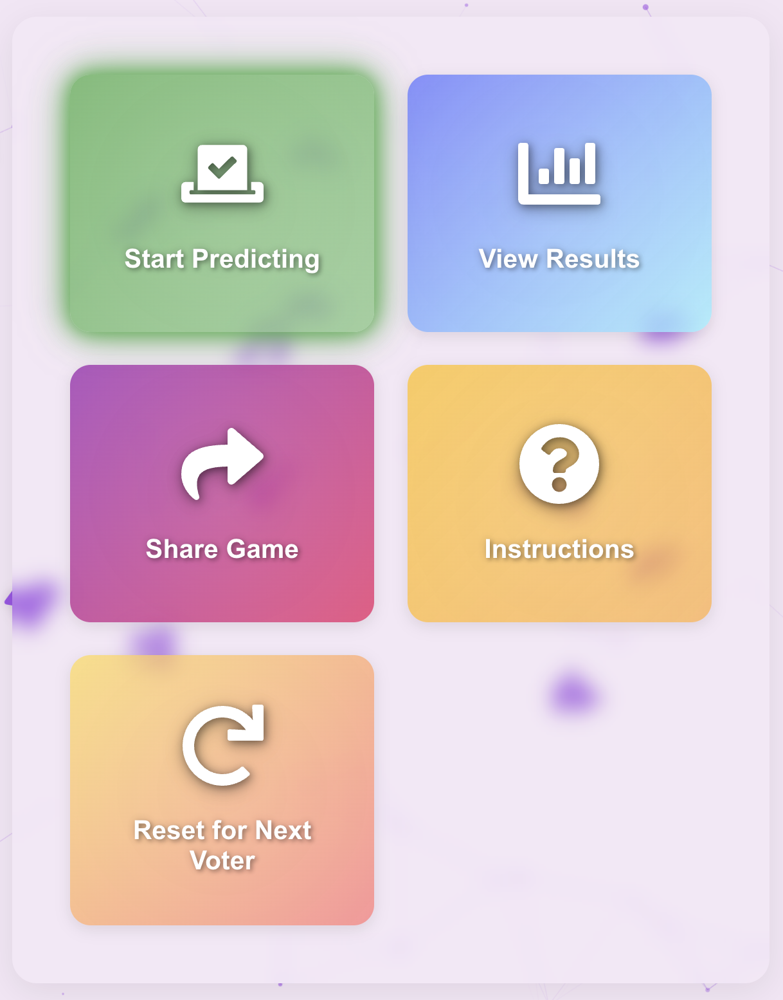
  <p><em>Welcome screen with multi-language support and simple navigation</em></p>
  
  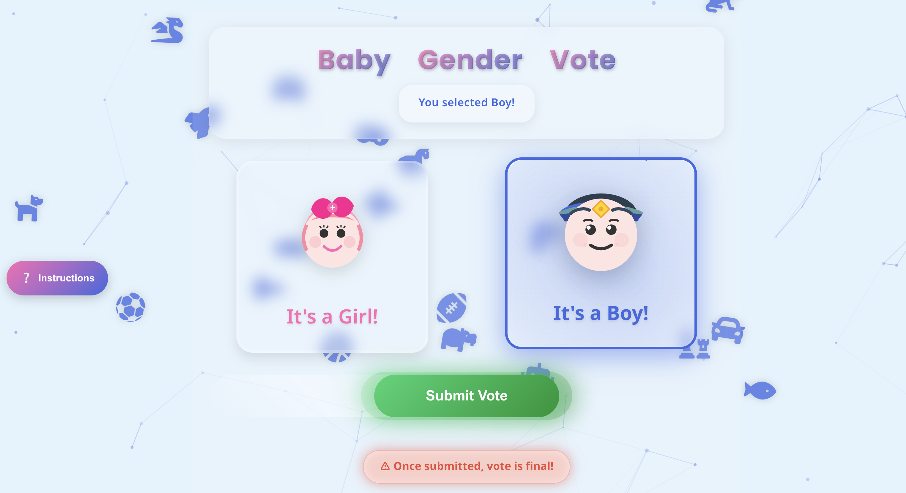
  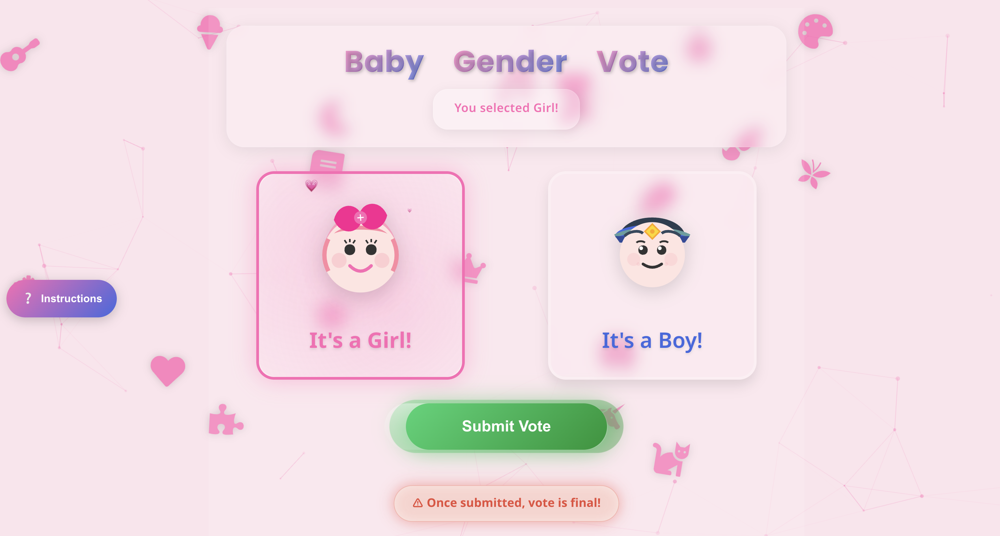
  <p><em>Gender selection interface with intuitive design and visual feedback</em></p>
</div>

### Results Visualization

<div align="center">
  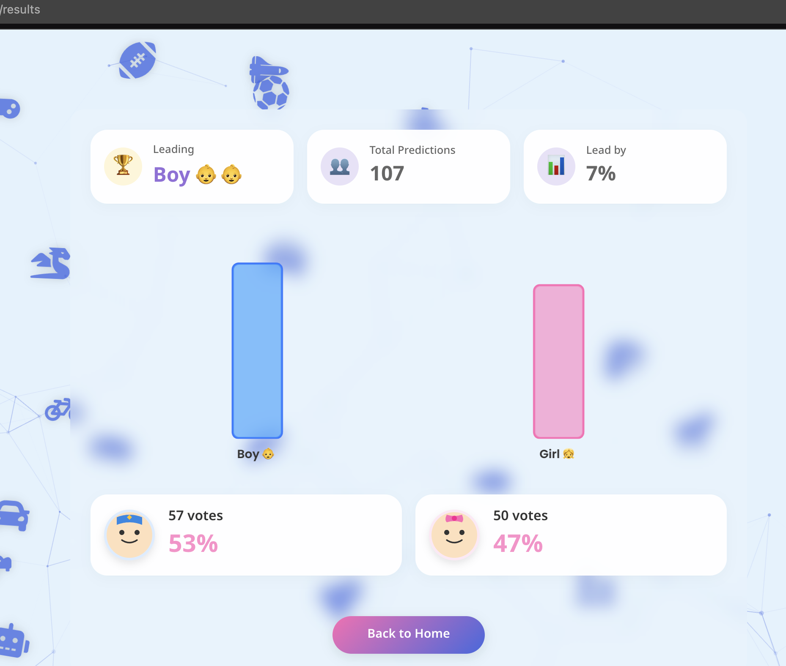
  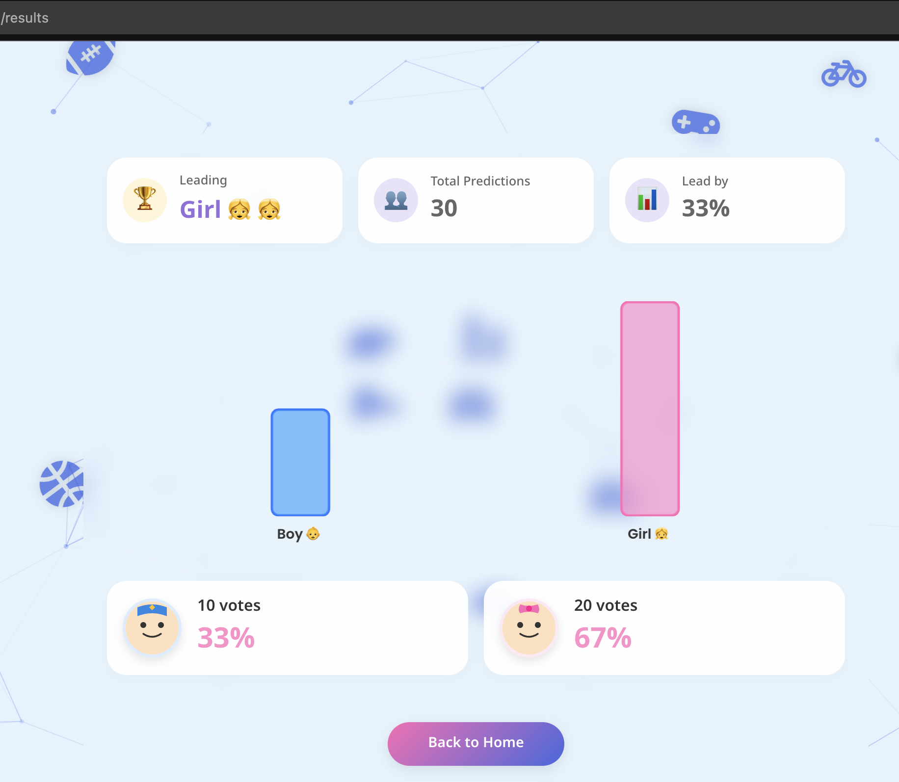
  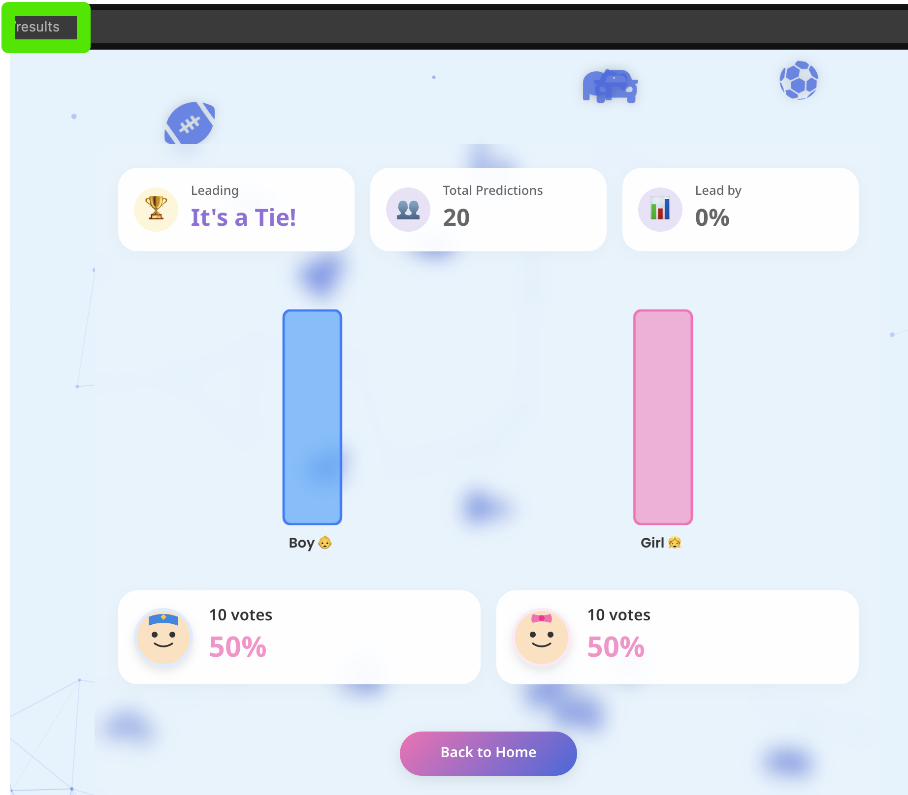
  <p><em>Dynamic results display with real-time updates and beautiful visualizations</em></p>
</div>

### Administrative Controls

<div align="center">
  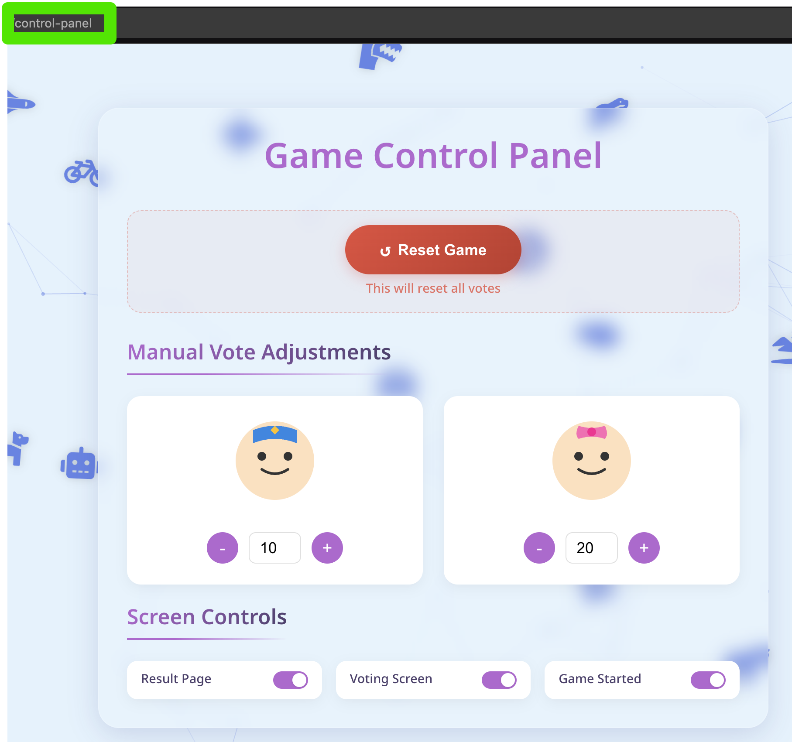
  <p><em>Comprehensive admin panel for complete game control</em></p>
  
  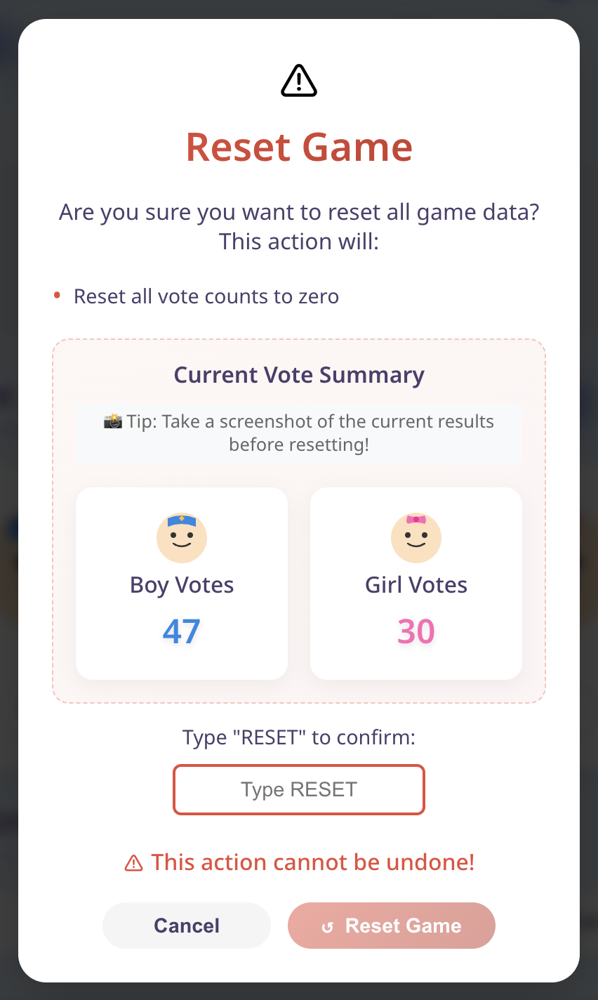
  <p><em>Safety confirmations for critical actions</em></p>
</div>

### User Experience Flows

<div align="center">
  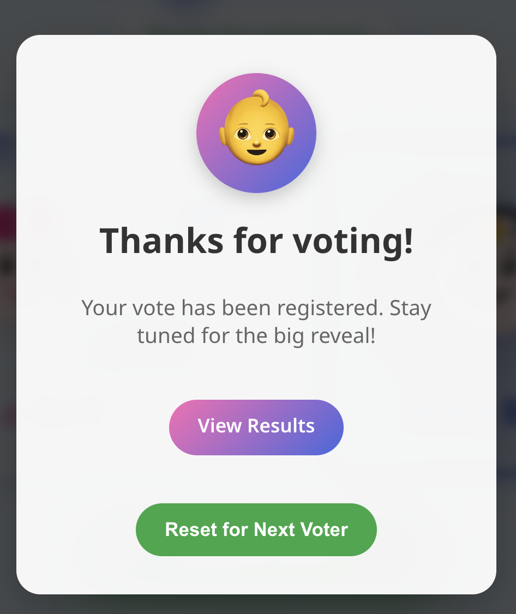
  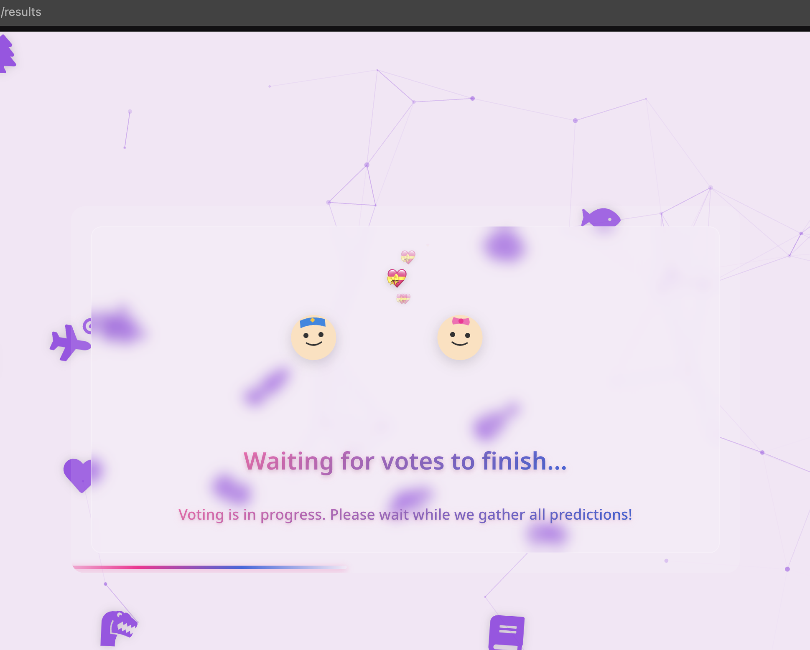
  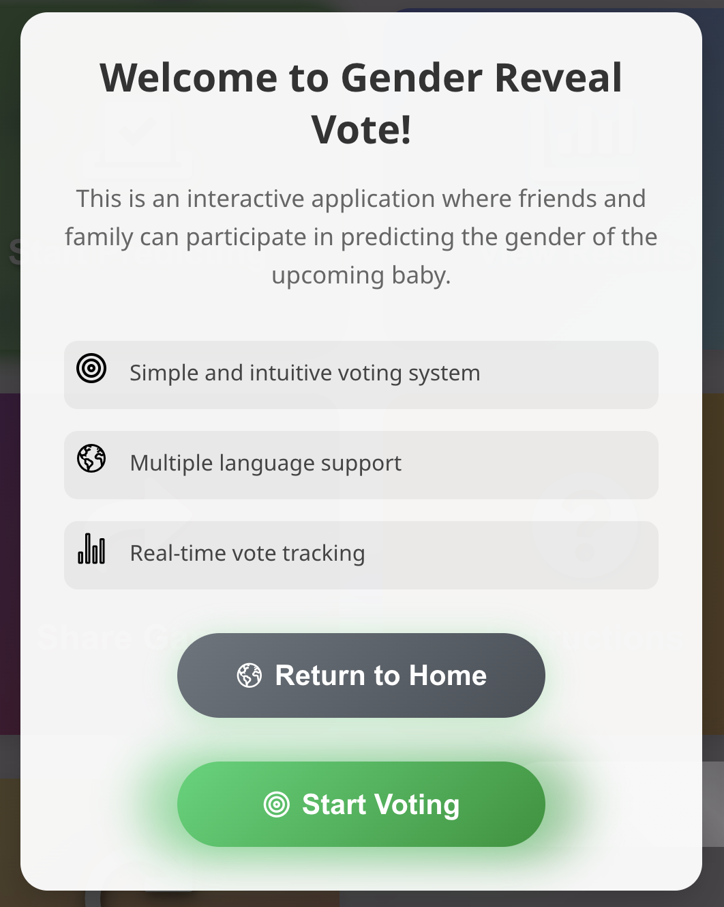
  <p><em>Engaging user journey with clear feedback and instructions</em></p>
</div>

## 🔧 Technical Details

### Technology Stack

- **Frontend**: React.js with Vite for blazing-fast development
- **Styling**: TailwindCSS for responsive design
- **State Management**: React Context API
- **Animations**: Framer Motion
- **Real-time Updates**: WebSocket integration
- **Icons**: Custom SVG components
- **Testing**: Jest and React Testing Library

### System Requirements

- Node.js v14.0.0 or higher
- npm v6.0.0 or higher
- Modern web browser with WebSocket support
- Minimum 512MB RAM
- Screen resolution: 320px minimum width

## 📥 Installation

1. **Clone the Repository**

   ```bash
   git clone https://github.com/rakshitbharat/open-source-baby-shower-game.git
   cd baby-shower-exit-poll-voting-app/source
   ```

2. **Install Bun** (if not already installed)

   ```bash
   curl -fsSL https://bun.sh/install | bash
   ```

3. **Install Dependencies**

   ```bash
   bun install
   ```

   This will generate the `bun.lockb` file for your environment.

4. **Environment Setup**

   ```bash
   cp .env.example .env
   ```

5. **Configure Firebase**

   Visit the [Firebase Console](https://console.firebase.google.com/) and:

   - Create a new project
   - Go to Project Settings > General
   - Scroll to "Your apps" and click the web icon (</>)
   - Register your app and copy the config

6. **Configure the `.env` file**

   Fill in your `.env` file with the Firebase configuration:

   ```ini
   # Firebase Configuration
   VITE_FIREBASE_API_KEY=abc123xyz789...
   VITE_FIREBASE_AUTH_DOMAIN=your-app.firebaseapp.com
   VITE_FIREBASE_DATABASE_URL=https://your-app-default-rtdb.firebaseio.com
   VITE_FIREBASE_PROJECT_ID=your-app
   VITE_FIREBASE_STORAGE_BUCKET=your-app.appspot.com
   VITE_FIREBASE_MESSAGING_SENDER_ID=123456789
   VITE_FIREBASE_APP_ID=1:123456789:web:abc123...

   # App Configuration
   VITE_REDIRECT_URL=https://your-domain.com/
   ```

7. **Start the Development Server**
   ```bash
   bun start # Starts dev server at http://localhost:5173
   ```

### Available Scripts

- `bun start` - Start the development server
- `bun run build` - Build for production
- `bun run preview` - Preview production build
- `bun run clean` - Remove node_modules
- `bun run clean:cache` - Clear Bun cache

### Firebase Setup Steps

Setting up Firebase for your project involves creating a Firebase project, configuring various services like Authentication and Realtime Database, and integrating them into your application.

#### 1. Create a Firebase Project

1. **Go to [Firebase Console](https://console.firebase.google.com/)**

   - Sign in with your Google account, or create one if you haven't already.

2. **Click on "Add Project"**

   - Enter your project name (e.g., "Baby Gender Reveal Vote").
   - (Optional) Edit the Project ID if you want a custom one.
   - Check the box to agree to the Firebase terms.
   - Click "Continue".

3. **Google Analytics Setup (Optional)**

   - You can enable Google Analytics for your project or skip it.
   - If you choose to enable it, select your Analytics account or create a new one.
   - Click "Continue".

4. **Click "Create Project"**

   - Wait for Firebase to set up your new project.

5. **Click "Continue"** to navigate to your Firebase project console.

#### 2. Configure Firebase for Your App

1. **Add an App to Your Project**

   - In the Firebase Console, find the "Your apps" section.
   - Click the `</>` Web icon to add Firebase to your web app.
   - Register your app by providing a nickname (e.g., "Voting App").
   - Check the box for "Also set up Firebase Hosting" if you plan to use it later (optional).
   - Click "Register app".

2. **Copy Firebase SDK Snippet**

   - You will receive the Firebase SDK configuration (a code snippet containing Firebase keys).
   - This information will be used to configure the Firebase SDK in your app.

3. **Modify your `.env` File**

   - Use the provided Firebase configuration to populate your `.env` file:

   ```ini
   VITE_FIREBASE_API_KEY=<your-api-key>
   VITE_FIREBASE_AUTH_DOMAIN=<your-auth-domain>
   VITE_FIREBASE_DATABASE_URL=<your-database-url>
   VITE_FIREBASE_PROJECT_ID=<your-project-id>
   VITE_FIREBASE_STORAGE_BUCKET=<your-storage-bucket>
   VITE_FIREBASE_MESSAGING_SENDER_ID=<your-sender-id>
   VITE_FIREBASE_APP_ID=<your-app-id>
   ```

#### 3. Set Up Realtime Database

1. **Navigate to Realtime Database in Firebase Console**

   - Click on "Realtime Database" in the left sidebar.

2. **Create a New Database**

   - Click "Create Database".
   - Choose "Start in Test Mode" to allow all reads and writes (be sure to change this in production).
   - Click "Next" and then "Done".

3. **Configure Database Rules**

   - Go to the "Rules" tab in the Realtime Database.
   - Replace the default rules with:

   ```json
   {
     "rules": {
       ".read": true,
       ".write": true,
       "gameState": {
         ".read": true,
         ".write": true,
         "vote": {
           ".read": true,
           ".write": true
         },
         "results": {
           ".read": true,
           ".write": true
         }
       }
     }
   }
   ```

   - Click "Publish" to apply the rules.

#### 4. Enable Authentication (Optional)

1. **Navigate to Authentication in Firebase Console**

   - Click on "Authentication" in the sidebar.

2. **Set Up Sign-In Method**
   - Go to the "Sign-in method" tab.
   - Enable "Email/Password" by toggling it on and then click "Save".

#### 5. Verify Firebase Setup

1. **Test Firebase Connection in Your App**

   - Run your app locally using `bun start` or the equivalent command.
   - Open the browser's development console (usually with F12 or right-click and Inspect).
   - Look for a message confirming a successful Firebase connection.

2. **Submit a Test Vote**
   - Use your application's voting feature to test that data is correctly written to the Realtime Database.

### Verification Steps

1. **Check if the app runs:**

   ```bash
   bun start
   ```

2. **Verify Firebase connection:**
   - Open browser console
   - Look for "Firebase Connected" message
   - Try submitting a test vote

### Common Setup Issues

1. **Firebase Connection Error**

   - Double-check all Firebase environment variables
   - Ensure database rules are set correctly
   - Verify project ID matches

2. **Bun Installation Issues**

   ```bash
   # Try cleaning cache
   bun clean:cache
   bun install
   ```

3. **Port Conflicts**
   ```bash
   # Use a different port
   VITE_PORT=3000 bun start
   ```

### Development Tips

- Use `bun start` for hot-reload development
- Check console for Firebase connection status
- Test on multiple browsers for compatibility
- Use React DevTools for debugging

## 🔍 Keywords

baby shower, gender reveal, voting app, baby gender prediction, virtual baby shower, gender reveal party, real-time voting, baby shower games, interactive baby shower, gender reveal ideas

## 📖 About

Baby Gender Reveal Vote is an interactive web application that transforms traditional gender reveal parties into engaging events. This open-source project allows friends and family to participate in predicting the baby's gender through a beautiful, real-time voting system.

### Why Choose This App?

- 🎯 **Perfect for Modern Celebrations**: Ideal for both in-person and virtual baby showers
- ⚡ **Real-time Experience**: Instant vote updates and live results
- 🌍 **Inclusive Design**: Multi-language support and mobile-responsive interface
- 🔒 **Secure**: One vote per user system with admin controls
- 🎨 **Beautiful Interface**: Engaging animations and themed design
- 💻 **Easy Setup**: Simple installation process with detailed documentation

### Use Cases

- Virtual Baby Showers
- In-person Gender Reveal Parties
- Family Gatherings
- Social Media Live Events
- Baby Shower Games
- Gender Prediction Contests

---

<div align="center">
  <h3>🌟 Star this repo if you found it helpful! 🌟</h3>
  
  [Follow me](https://github.com/rakshitbharat) for more awesome projects!
</div>

